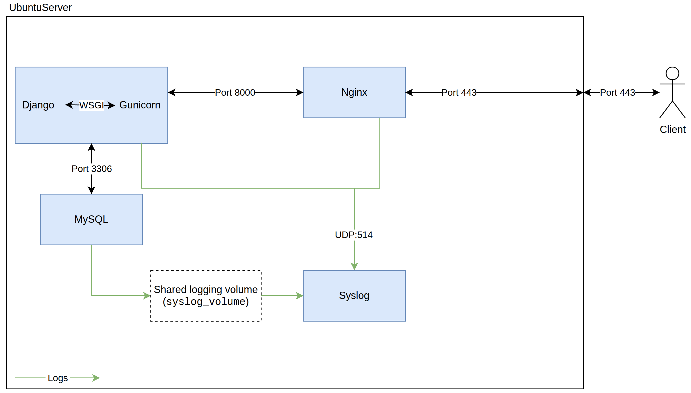
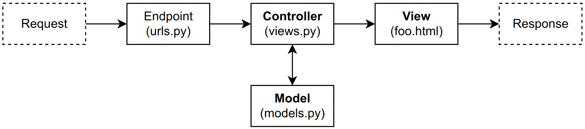
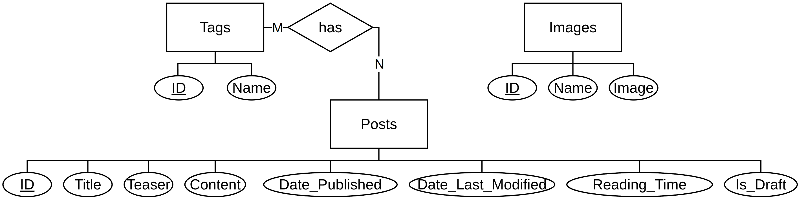

# Personal Website

[](https://github.com/Jonathan2k19/personal-website/actions/workflows/ci.yml)

Source code for [my personal website](https://jonathan.binkle.eu), built with Django. It hosts a small blog (Markdown-based, MySQL-backed) and is containerized with Docker, sitting behind NGINX with TLS.

This was built ~2 years ago to learn Docker/NGINX/TLS/Django etc., not as the ideal way to run a personal blog. A static site generator would honestly be simpler, faster, and more secure.

This README serves as a wiki. Contents:
- [Quick start](#quick-start)
- [Architecture](#architecture)
- [Configuration](#configuration)
- [Production](#production)
- [How the Django App Works](#how-the-django-app-works)
- [Security](#security)
- [Operations](#operations)
- [Future TODOs](#future-todos)

---

## Quick start

Requirements: install the [Docker Engine](https://docs.docker.com/engine/install/).

```bash
git clone <this-repo-url> website
make setup-dev
```

This builds and starts the Django + MySQL containers, runs migrations, and seeds the database with fake blog posts (see `portfolio/create_fake_data.py`). The site is then available at `http://localhost:8000`.

Default dev superuser (from `create_fake_data.py`): `TestAdmin` / `TestPassword`. It is not created in production.

The project directory is bind-mounted read-only into the container (`WWW_ROOT_HOST` -> `WWW_ROOT`), so editing files on the host and refreshing the browser is enough - no rebuild needed for Python/template/static changes.

If you want to reset the fake data without restarting containers:

```bash
docker exec -it portfolio-django python manage.py flush --no-input
```

To run all tests:

```bash
make test
```

To tear down the dev environment:

```bash
make teardown-dev
```

---

## Architecture



Four containers in production (`docker/compose.prod.yaml`):

| Container | Role                                                                                                                                                                                           |
| --------- | ---------------------------------------------------------------------------------------------------------------------------------------------------------------------------------------------- |
| `django`  | Runs the Django app under Gunicorn (WSGI). Not exposed publicly - only reachable from `nginx` over the Docker network.                                                                         |
| `mysql`   | Database. Also not exposed publicly.                                                                                                                                                           |
| `nginx`   | Reverse proxy, TLS termination, static/media file serving, rate limiting, response caching. The only container with published ports (`80`, `443`). Port 80 is redirected automatically to 443. |
| `syslog`  | Centralized log collector (`syslog-ng`). Receives logs from Django/Gunicorn/NGINX over UDP; reads MySQL logs via a shared volume.                                                              |

In development (`docker/compose.yaml`) there's no NGINX or syslog container - just `django` (Django's dev server, not Gunicorn, exposed on localhost) and `mysql`.

---

## Configuration

All configuration comes from environment variables, loaded via `docker compose`'s `env_file: .env` (a symlink to either `.env.dev` or `.env.prod`, switched by `make setup-dev` / `make setup-prod`).

| Variable                                                                                                                            | Notes                                                                                                                                                                                                             |
| ----------------------------------------------------------------------------------------------------------------------------------- | ----------------------------------------------------------------------------------------------------------------------------------------------------------------------------------------------------------------- |
| `DEBUG`                                                                                                                             | `1` in dev, unset/`0` in prod. Also gates test DB creation and static/media serving via Django itself.                                                                                                            |
| `SECRET_KEY`                                                                                                                        | Django's cryptographic signing key. Generate: `python -c "from django.core.management.utils import get_random_secret_key; print(get_random_secret_key())"`                                                        |
| `ALLOWED_HOSTS`                                                                                                                     | Space-separated allow list of HTTP `Host` headers.                                                                                                                                                                |
| `CSRF_TRUSTED_ORIGINS`                                                                                                              | Space-separated allow list of hosts that may send unsafe (e.g., POST) requests to the host (origin hosts indicated by HTTP `Origin` or `Referer` header); `https://` is prepended automatically in `settings.py`. |
| `ADMIN_PATH`                                                                                                                        | Path to the admin console, e.g. `my-admin/`. Randomizing this makes it harder to find for bots that try to crack admin login credentials.                                                                         |
| `APP_ROOT`                                                                                                                          | Where `staticfiles/`, `mediafiles/` live inside containers.                                                                                                                                                       |
| `WWW_ROOT`                                                                                                                          | Path to the Django project inside the container.                                                                                                                                                                  |
| `WWW_ROOT_HOST`                                                                                                                     | Path to the project on the host (VPS), bind-mounted read-only into the container for live-reload during dev.                                                                                                      |
| `DJANGO_ADMIN_FIRST_NAME`, `DJANGO_ADMIN_LAST_NAME`, `DJANGO_ADMIN_USERNAME`, `DJANGO_ADMIN_PASSWORD`, `DJANGO_ADMIN_EMAIL`         | Django admin credentials.                                                                                                                                                                                         |
| `DJANGO_SITE_DOMAIN`                                                                                                                | Domain to show in sitemap.                                                                                                                                                                                        |
| `DJANGO_PORT`                                                                                                                       | Internal port Django dev server or Gunicorn listens on.                                                                                                                                                           |
| `PYTHON_VERSION_ENV`                                                                                                                    | The Python version to use.                                                                                                                                                                                        |
| `MYSQL_DATABASE`, `MYSQL_USER`, `MYSQL_PASSWORD`, `MYSQL_HOST`, `MYSQL_PORT`                                                        | DB connection details.                                                                                                                                                                                            |
| `MYSQL_TEST_DATABASE`                                                                                                               | Only used when `DEBUG=1`; Django creates/tears this down automatically when running tests.                                                                                                                        |
| `MYSQL_ROOT_PASSWORD`                                                                                                               | Prod only.                                                                                                                                                                                                        |
| `NGINX_VOL_GID_HOST`                                                                                                                | Group ID of file permission of `docker/nginx/vol/*` on host (VPS). Should be same as the GID of the NGINX user to avoid permission issues.                                                                        |

Example production settings (`.env.prod`):
- Note: the `.` in front of `my-domain.example.com` means "all subdomains of `my-domain.example.com` are also allowed"

```
SECRET_KEY='change-me'
ALLOWED_HOSTS='.my-domain.example.com'
CSRF_TRUSTED_ORIGINS='.my-domain.example.com'
ADMIN_PATH='admin-0xdeadbeef/'
APP_ROOT='/home/django'
WWW_ROOT='/home/django/www'
DJANGO_PORT='8000'
DJANGO_SITE_DOMAIN='my-domain.example.com'
DJANGO_ADMIN_FIRST_NAME='change-me'
DJANGO_ADMIN_LAST_NAME='change-me'
DJANGO_ADMIN_USERNAME='change-me'
DJANGO_ADMIN_PASSWORD='change-me'
DJANGO_ADMIN_EMAIL='change-me'
PYTHON_VERSION_ENV='3.14'
NGINX_VOL_GID_HOST='1000'
MYSQL_DATABASE='portfolio_db'
MYSQL_PASSWORD='change-me'
MYSQL_ROOT_PASSWORD='change-me'
MYSQL_PORT='3306'
MYSQL_HOST='mysql'
WWW_ROOT_HOST='/path/to/personal-website-repo-on-VPS/portfolio'
```

Example dev settings (`.env.dev`):

```
DEBUG=1
SECRET_KEY='change-me'
ALLOWED_HOSTS='localhost 127.0.0.1 [::1]'
CSRF_TRUSTED_ORIGINS='localhost 127.0.0.1 [::1]'
ADMIN_PATH='admin-123/'
APP_ROOT='/home/django'
WWW_ROOT='/home/django/www'
DJANGO_PORT='8000'
DJANGO_SITE_DOMAIN='my-domain.example.com'
PYTHON_VERSION_ENV='3.14'
MYSQL_DATABASE='portfolio_db'
MYSQL_TEST_DATABASE='portfolio_test_db'
MYSQL_USER='portfolio_user'
MYSQL_PASSWORD='change-me'
MYSQL_PORT='3306'
MYSQL_HOST='mysql'
WWW_ROOT_HOST='/path/to/personal-website-repo/portfolio'
```

---

## Production

```bash
make setup-prod
```

This uses `compose.prod.yaml`, which brings up all four containers. Compared to dev:
- Django runs under Gunicorn, not the dev server (see `gunicorn.conf.py`).
- The Django and NGINX containers run as non-root users (`django`, matching UID `101` so file ownership lines up across the shared volume with NGINX's own non-root user).
- `syslog-ng` centralizes logs from all containers.

Note: `entrypoint.prod.sh` runs `manage.py flush --no-input` on every container start, same as the dev entrypoint. In dev this generates fresh fake data each time; in prod it wipes the production database, so make sure to back it up.

### File Serving

Django has the concept of static files (app assets, like JS or CSS) and media files (user-uploaded files; here: blog images).

Both are served from NGINX in production. The `django` and `nginx` containers share two volumes for that (`static_volume`, `media_volume`). Django's `collectstatic` (run in `entrypoint.prod.sh`) populates the static volume on each deploy.

### Maintenance Mode

```bash
make enable-maintenance
make disable-maintenance
```

Drops a static `maintenance.html` file into the NGINX container; an `if` block in the NGINX config checks for its existence and returns `503` for all requests if present, without ever reaching Django.

### Logging Into Container

MySQL:

```bash
sudo docker exec -it portfolio-mysql-prod mysql -u root -p
```

### VPS Config

I host the site on a Ubuntu Server 24.04 LTS in Hetzner Cloud. Here's a brief overview of the VPS config.

#### Automatic Upgrades

Initially, upgrade everything manually:

```bash
sudo apt update && sudo apt upgrade -y
```

Then configure automatic (security) updates:

```bash
sudo apt install unattended-upgrades
sudo dpkg-reconfigure unattended-upgrades
```

Check `/etc/apt/apt.conf.d/50unattended-upgrades` to have at least automatic security upgrades enabled:

```c
Unattended-Upgrade::Allowed-Origins {
        "${distro_id}:${distro_codename}";
        "${distro_id}:${distro_codename}-security";
        "${distro_id}ESMApps:${distro_codename}-apps-security";
        "${distro_id}ESM:${distro_codename}-infra-security";
};
```

After a while, check that automatic upgrades work: `/var/log/unattended-upgrades/unattended-upgrades.log`.

#### SSH

Create an SSH keypair on your client:

```bash
ssh-keygen -t ed25519
```

Upload the public key to the server, to be stored in `~/.ssh/authorized_keys`:

```bash
cat ~/.ssh/<the-key>.pub | ssh -p23 <user>@<vps-ip> install-ssh-key
```

Set up an OpenSSH server config (`man sshd`, `man sshd_config`) in `/etc/ssh/sshd_config` (create a backup of the old config):

```
AddressFamily any
ListenAddress 0.0.0.0
ListenAddress ::
PermitRootLogin no
LogLevel VERBOSE
MaxAuthTries 3
ChallengeResponseAuthentication no
PasswordAuthentication no
GSSAPIAuthentication no
HostbasedAuthentication no
PubkeyAuthentication yes
PermitEmptyPasswords no
X11Forwarding no
Banner none
PrintMotd no

# Required for SCP unless -O flag is given
Subsystem       sftp    /usr/lib/openssh/sftp-server
```

(Re-)start `sshd`:

```bash
sudo systemctl restart ssh
```

##### `fail2ban`

You may also want to create a `fail2ban` jail for SSHD to rate-limit login attempts:

```bash
sudo apt install fail2ban
sudo systemctl start --now fail2ban
sudo cp /etc/fail2ban/jail.conf /etc/fail2ban/jail.local
```

Then in the `[sshd]` jail line in `/etc/fail2ban/jail.local` have:

```bash
enabled = true
```

And verify:

```bash
sudo fail2ban-client status
```

#### Docker DNS

Register the VPS's (or any other) DNS resolvers in `/etc/docker/daemon.json`. For [Hetzner Cloud](https://docs.hetzner.com/robot/dedicated-server/general-information/recursive-name-servers/):

```json
{
    "dns": ["185.12.64.1", "185.12.64.2"]
}
```

#### Host Firewall

`ufw` is used to create a host firewall:

```bash
apt install ufw

ufw status # 'inactive' by default

ufw allow ssh
ufw allow http
ufw allow https

# Warning: make sure SSH is allowed to not be locked out!
ufw enable
 
# Verify: 'active' and allow only SSH, HTTP, HTTPS (IPv4 and IPv6)
ufw status verbose
```

---

## How the Django App Works

Two Django apps: `core` is everything that isn't blog-specific, `blog` is the actual blog.

It's essentially a Model-View-Controller (MVC) architecture:



### Blog

#### Database Layout

ER model:



Django's `ManyToManyField` realizes the N:M `Tags`-`Posts` relation without the need of manually creating a table containing foreign keys to the two entities in relation.

`Images` isn't a foreign key on `Posts`. Images are uploaded separately via the admin, get a stable filename, and are referenced by hand from post content using `` tags. NGINX serves them at `/media/blog_images/<name>.<ext>`.

If a post has `is_draft` set only the admin sees it.

Note: if you change the layout, don't forget to create a migration that reflects the change (in the dev environment; in prod this will fail because the volume is mounted read-only):

```bash
sudo docker exec portfolio-django python /home/django/www/manage.py makemigrations core blog
```

This should create, e.g, `blog/migrations/0001_initial.py`. Commit these migrations because in production we only run `migrate`, not `makemigrations`.

#### Markdown Rendering

Post `title`, `teaser`, and `content` are stored as raw Markdown and rendered to HTML at request time via a custom template filter, `md2html` (`blog/templatetags/custom_filters.py`), built on [python-markdown](https://python-markdown.github.io/).

### File Downloads

Arbitrary downloadable files (PDFs, etc., not blog images) go through `core.models.Files`, uploaded via the admin, and served at `/media/<name>`.

### Sitemap & RSS

- `sitemap.xml` is built from Django's `django.contrib.sitemaps`, combining a `PostSitemap` (all non-draft posts) and a `GenericSitemap` (static pages like `/`, `/contact/`, `/blog/posts/`, discovered by introspecting each app's `urls.py` and skipping any URL that takes a parameter).
- `/blog/rss/` is a standard Django `Feed` view, also filtered to non-draft posts.

---

## Security

### Content Security Policy (CSP)

A custom nonce-based CSP (`core/middleware.py`) mitigates the impact of any XSS that might sneak through. It starts restrictive (`default-src 'none'`) and relaxes only what's needed. Each request gets a random 128-bit nonce, passed to templates via a context processor (`core/context_processors.py`). Usage example:

```html
<script nonce="{{ csp_nonce }}">
    console.log("Hello, World!");
</script>
```

Note: newer Django versions (6.0+) ship CSP support built in.

### TLS

The TLS config (`docker/nginx/vol/tls.conf`) is based on the "modern" config by [TLSRef](https://docs.tlsref.org/), only supporting TLS 1.3, with HSTS max-age 1 year.
- Note: to test a new TLS config (or any NGINX config), run `sudo docker exec portfolio-nginx-prod nginx -t`

[ssllabs](https://www.ssllabs.com/ssltest/) gives the config an `A` score.

Certificates are Let's Encrypt, which can be renewed via `nginx/tls-cert-renewal.sh`. The following script notifies me of an upcoming certificate expiration via email (registered as a daily cronjob):

```bash
#!/bin/bash

MAIL="me@example.com"

if [ $(id -u) -ne 0 ]; then
    echo "Script requires root privileges!"
    exit 1
fi

for DOMAIN_PATH in /etc/letsencrypt/live/*; do
    if [ ! -f "$DOMAIN_PATH/fullchain.pem" ]; then
        continue
    fi

    EXPIRY_RAW=$(openssl x509 -enddate -noout -in "$DOMAIN_PATH/fullchain.pem" | cut -d= -f2)
    EXPIRY=$(date -d "$EXPIRY_RAW" +%s)
    NOW=$(date +%s)
    DAYS_LEFT=$(((EXPIRY - NOW) / 86400))

    if [ $DAYS_LEFT -le 5 ]; then
        DOMAIN=$(basename "$DOMAIN_PATH")
        echo -e "To: $MAIL\nSubject: TLS certificate expires soon\n\nCertificate for $DOMAIN expires in $DAYS_LEFT days ($EXPIRY_RAW)!" | /usr/bin/msmtp $MAIL
    fi
done
```

#### OCSP Stapling

The Online Certificate Status Protocol (OCSP) lets a browser ask the CA that issued a certificate (here: Let's Encrypt) whether that certificate is still valid or has been revoked. Two problems with this:
- high load on OCSP servers
- privacy: OCSP servers learn which domain a client visits

OCSP stapling addressed both: instead of the browser querying the CA, the TLS server (here, NGINX) periodically fetches a signed, time-stamped OCSP response from the CA itself and attaches ("staples") it to the TLS handshake. The browser gets its revocation proof without ever talking to the CA directly. Lower load, no per-visitor leak.

My original TLS config had this enabled:

```nginx
ssl_stapling on;
ssl_stapling_verify on;
ssl_trusted_certificate /etc/nginx/vol/tls/chain.pem;
resolver 185.12.64.1 185.12.64.2 [2a01:4ff:ff00::add:1] [2a01:4ff:ff00::add:2];
resolver_timeout 5s;
```

An SSL Labs scan from 3rd Oct 2024 confirmed stapling was active. A later scan showed it as "No." `nginx -t` explained why: 

```
nginx: [warn] "ssl_stapling" ignored, no OCSP responder URL in the certificate "/etc/nginx/vol/tls/fullchain.pem" 
```

Turns out [Let's Encrypt deprecated OCSP](https://letsencrypt.org/2025/08/06/ocsp-service-has-reached-end-of-life) in favor of Certificate Revocation Lists (CRLs). Further details:
- https://letsencrypt.org/2022/09/07/new-life-for-crls
- https://letsencrypt.org/2024/12/05/ending-ocsp

### Rate limiting

NGINX rate-limits by client IP (`/32` for IPv4, `/64` for IPv6) at 5 req/s with a burst allowance of 10 - see `docker/nginx/vol/conf.d/nginx.conf`. It's not ideal but is probably sufficient to mitigate simple brute-force attacks.

### Image Upload Sanitization

Uploaded images (`blog.models.Images`) are re-encoded and saved with Pillow, to discard any non-image data from the uploaded "image". This should offer a more thorough protection than just checking whether magic bytes match.

### Path Traversal Protection

`os.path.basename()` on every user-supplied filename before it touches the filesystem, in both `core.views.view_file` and the `save()` methods of `core.models.Files` / `blog.models.Images`.

### Non-root Container Users

Container processes run as non-root users.

### Randomized Admin Path

The admin console lives at `ADMIN_PATH` (`.env`) instead of `/admin/`. `ADMIN_PATH` should be hard to guess, for example, `/admin-<random-string>/`. While this is not a real security measure it reduces noise from bots.

### Secure Cookies

`settings.py` marks the session- and CSRF-cookies as `HttpOnly`, `SameSite=Lax`, `Secure`.

### Database Privileges

MySQL is set up with only the required privileges for Django: the app's DB user gets `ALTER, CREATE, DELETE, DROP, INDEX, INSERT, SELECT, REFERENCES, UPDATE` on the app database only (see `docker/mysql/mysql_init_scripts/prod/setup.prod.sql`).

To check current grants:

```sql
SHOW GRANTS FOR 'portfolio_user'@'%';
```

### Updates

The host receives automatic security updates via `unattended-upgrades`. It has to be manually rebooted sometimes (currently there's no automatic reboot + restore web app).

The latest Django LTS version - 5.2 - is used ([supported until 04/2028](https://www.djangoproject.com/download/)).

Python3.14 is used, [compatible with Django 5.2.8+](https://docs.djangoproject.com/en/6.0/releases/5.2/#python-compatibility).

GitHub Dependabot creates PRs for updates of Python dependencies and Docker base image. The `requirements.txt` specifies `Django~=5.2.15` to not get PRs for upgrade to Django 6.

---

## Operations

### GitHub CI & Dependabot

#### GitHub CI

I have created a simple GitHub CI workflow that runs on push to any branch and on pull request into `main` (see `.github/workflows/ci.yml`).

A `.env.dev` is stored as a [GitHub Actions secret](https://docs.github.com/en/actions/how-tos/write-workflows/choose-what-workflows-do/use-secrets):
- Settings > Security and quality > Secrets and variables > Actions > New repository secret
- Name of file: `DEV_ENV_FILE`

#### Dependabot

Dependabot creates PRs if versions should be bumped. See `.github/dependabot.yml`.

#### Deploy Key

To access the git repository from the VPS, a deploy key with read-only privileges is used.

### Logging

What is logged:
- MySQL: general/slow-query/error logs
- Gunicorn: error logs (access logs covered by NGINX); info level
- NGINX: error logs (info level), access logs (info level)
- Django: info level

All containers log to a centralized `syslog-ng` container over `UDP:514`, except MySQL, which I never managed to get logging over the network - it writes to a shared volume that `syslog-ng` reads as local files instead (see `docker/syslog-ng/vol/syslog-ng.conf`).

Client IP addresses are stripped from NGINX error logs via a `syslog-ng` rewrite rule (access logs are told not to include the IP in the first place; error logs don't support a custom format in NGINX).

Final logs are stored to `/var/log/portfolio/*.log` of the `syslog-ng` container.

Logs rotate daily (or at 100MB, whichever comes first) via `logrotate`, kept for 14 days, compressed - see `docker/syslog-ng/vol/logrotate.conf`.

The cronjob that triggers daily rotation is actually running on the host, not the container (couldn't get `cron` to work inside the `syslog-ng` container).

```bash
# running as root
0 0 * * * docker exec portfolio-syslog-prod sh -c '/usr/sbin/logrotate -f /etc/logrotate.conf' | /usr/bin/logger -t CRON
```

Useful command to trigger MySQL logs:

```mysql
SELECT SLEEP(11);
```

Useful command to reload syslog-ng config:

```bash
sudo docker exec portfolio-syslog-prod syslog-ng-ctl reload
```

### Backup & Restore

```bash
make create-backup
make restore-backup
```

`create-backup` dumps the MySQL database and copies the `media/` volume, bundling both into a timestamped tarball.

`restore-backup` recreates the database from the dump and replaces the media directory contents.

In my own deployment this runs daily via cron, piping to a remote backup server over SSH (see `backup.sh`).

### Updates

I try to do a maintenance every 2 weeks, roughly:
- review GitHub dependabot PRs, bumping versions
- then, on the VPS:
```bash
sudo make teardown-prod

apt update
apt full-upgrade

git pull

sudo make docker-prune # start fresh

sudo reboot now # if necessary

sudo make docker-pull # pull fresh images

sudo make setup-prod && sudo make enable-maintenance && sudo make restore-backup

# ... check if containers are healthy ...

sudo make disable-maintenance
```

This isn't ideal but it's not a high-security/traffic site anyway, and I don't have the time/motivation to setup a more complex industry-grade solution.

### Email Notifications

To be able to send emails (e.g., TLS certificate expiration warning) from VPS to myself, I've setup [msmtp](https://wiki.archlinux.org/title/Msmtp) on the VPS.

```bash
sudo apt install msmtp msmtp-mta
```

It uses Gmail's SMTP server

Config (`/etc/msmtprc`):

```bash
# Set default values for all following accounts.
defaults
auth           on
tls            on
tls_trust_file /etc/ssl/certs/ca-certificates.crt
logfile        ~/.msmtp.log

# Gmail SMTP
account        gmail
host           smtp.gmail.com
port           587
tls_starttls   on
from           your-name@your-domain.com
user           your-name@gmail.com
password       your-gmail-app-password # https://support.google.com/mail/answer/185833

# Set a default account
account default: gmail
```

The file contains a plaintext password; secure it:

```bash
sudo chmod 600 /etc/msmtprc
sudo chown root:root /etc/msmtprc
```

The reason for using SMTP/STARTTLS (port 587) instead of SMTP/TLS (port 465) is that [Hetzner blocks ports 25 and 465](https://docs.hetzner.com/cloud/servers/faq#why-can-i-not-send-any-mails-from-my-server).

Usage:

```bash
echo -e "From: alice\nTo: bob\nSubject: Hello\n\nHello from Alice!" | /usr/bin/msmtp bob@example.com
```

### Reboot Notification

I added the following to the end of `~/.bashrc` to be notified on SSH login whether I should reboot the server:

```bash
if [ -f /var/run/reboot-required ]; then
        echo "*** reboot required by the following packages ***"
        cat /var/run/reboot-required.pkgs
        echo ""
fi
```

---

## Future TODOs

- The current test suite mostly tests the Django application itself. It doesn't test the production environment and interaction of all components. Thus, a more extensive test suite is a TODO.
- Less manual work outside of the containers (file permissions, cronjob of syslog-ng logrotate, etc.)
- Currently, UID/GID of files have to match for shared volumes to not get permission issues when trying to access a file that the host created, from within a container. This is fragile.
- Improve update/patch management, e.g.
    - automatic security updates for Docker images
    - automatic reboot of VPS + restoring containers
- 2FA on the admin account
- Use a proper secret manager instead of `.env` files
- Deploy many Django container and load-balance
- Split frontend/backend: single page app (e.g., VueJS) against backend Django REST API
- Strip parts of Bootstrap/... that aren't actually used
- Use a management command instead of `create_admin.prod.py` or `create_site.py`
- Use a better URL scheme, especially no numerical id of blog post/tag
- Multiple database replicas
